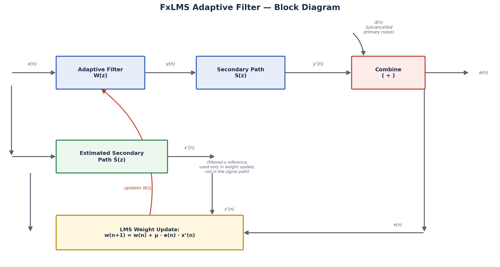

# FxLMS Algorithm (Filtered-x Least Mean Squares)

## 1. Purpose
Document the theory of the Filtered-x LMS algorithm — the core adaptive-filtering engine used in our system — and clearly separate general FxLMS theory from our specific browser implementation.

## 2. Why It Is Required in This Project
The problem statement requires an *adaptive* cancellation controller. A plain LMS filter cannot be used directly because the cancelling signal must pass through the secondary path `S(z)` before it acoustically combines with the noise; this path introduces a delay/phase shift that de-correlates the reference signal from the error signal and destabilizes plain LMS. FxLMS corrects for this by filtering the reference signal through an *estimate* of the secondary path before it is used in the weight-update rule, restoring the statistical validity of the gradient estimate.

## 3. Conventional ANC (Recap)
As described in `ANC_Fundamentals.md`, conventional feedforward ANC uses a reference microphone, an adaptive controller, a secondary loudspeaker, and an error microphone, with the objective of minimizing the residual error `e(n)`.

## 4. Adaptive Filtering and LMS
An adaptive FIR filter with coefficient (weight) vector `w(n) = [w0(n), w1(n), ..., w(L-1)(n)]^T` produces an output:

```
y(n) = w(n)^T x(n)
```

where `x(n) = [x(n), x(n-1), ..., x(n-L+1)]^T` is the reference signal vector. The classical **LMS algorithm** minimizes the mean-square error `E[e(n)^2]` using stochastic gradient descent:

```
w(n+1) = w(n) + μ · e(n) · x(n)
```

where `μ` is the step size. LMS assumes the filter output directly forms part of the error signal without passing through any additional filtering — an assumption that does not hold in ANC because of the secondary path.

## 5. Why FxLMS Is Required
In ANC, the controller output `y(n)` is not compared directly with `d(n)`; instead it is `y'(n) = s(n) * y(n)` (the acoustic result *after* the secondary path) that combines with `d(n)`. If the LMS update above is applied using the *unfiltered* reference `x(n)`, the gradient direction used for the weight update is no longer correct, and the algorithm can converge slowly or become unstable, particularly when `S(z)` introduces significant delay or phase shift. FxLMS solves this by "filtering the reference signal through the same path" (hence *filtered-x*) using an estimate `Ŝ(z)` of the secondary path, so the update direction is properly aligned with the true gradient.

## 6. Reference Signal
`x(n)`: the signal from the reference microphone/sensor, assumed correlated with the noise source. Its quality (coherence with the actual noise arriving at the error mic) directly bounds achievable attenuation.

## 7. Desired/Error Signal
`d(n)`: the (unobservable in isolation) noise that would arrive at the error mic with no cancellation. `e(n)`: the microphone-measured residual, `e(n) = d(n) - y'(n)`, which is the only quantity actually available to the algorithm.

## 8. Secondary Path
`S(z)`: the transfer function from the controller's digital output, through the D/A converter, power amplifier, loudspeaker, acoustic propagation, error microphone, and A/D converter, back into the digital domain. FxLMS requires an estimate `Ŝ(z)` of this path (see `Secondary_Path_Modeling.md`).

## 9. Filtered-x Signal
The reference vector is filtered through the estimated secondary path to form the *filtered-x* signal:

```
x'(n) = ŝ(n) * x(n)
```

where `ŝ(n)` is the impulse response corresponding to `Ŝ(z)`.

## 10. Adaptive Filter Coefficients and Weight-Update Equation
The FxLMS weight-update rule is:

```
w(n+1) = w(n) + μ · e(n) · x'(n)
```

where `x'(n) = [x'(n), x'(n-1), ..., x'(n-L+1)]^T` is the filtered-x reference vector. This is identical in form to LMS except that the plain reference vector `x(n)` is replaced by the filtered-x vector `x'(n)`.

## 11. Variables and Their Meanings

| Symbol | Meaning |
|---|---|
| `w(n)` | Adaptive filter coefficient vector at time `n` |
| `x(n)` | Reference signal vector |
| `x'(n)` | Filtered-x reference vector (`x(n)` filtered through `Ŝ(z)`) |
| `y(n)` | Controller output before the secondary path |
| `y'(n)` | Controller output after the secondary path |
| `d(n)` | Uncancelled desired/primary noise at the error mic |
| `e(n)` | Measured error signal |
| `S(z)` / `s(n)` | True secondary path / its impulse response |
| `Ŝ(z)` / `ŝ(n)` | Estimated secondary path / its impulse response, used inside FxLMS |
| `μ` | Step size (learning rate) |
| `L` | Adaptive filter length (number of taps) |

## 12. Algorithm / Pseudocode

```
Initialize w = 0 (length L), choose μ, obtain Ŝ(z) (offline or online estimate)
for each sample n:
    x(n) = new reference sample
    y(n) = w(n)^T · [x(n), x(n-1), ..., x(n-L+1)]
    output y(n) to secondary source
    e(n) = measured error microphone sample
    x'(n) = ŝ(n) * x(n)             # filter reference through estimated secondary path
    w(n+1) = w(n) + μ · e(n) · x'(n)
end for
```

## 13. Block Diagram Description

```
x(n) ──►[ Adaptive Filter W(z) ]──► y(n) ──►[ Secondary Path S(z) ]──► y'(n) ──┐
  │                                                                            ▼
  │                                                          d(n) ──────────►(+ combine)──► e(n)
  │                                                                            │
  └──►[ Estimated Secondary Path Ŝ(z) ]──► x'(n) ─────────────────────────────┘
                                                    (used only in weight-update, not in signal path)
                                                                                │
                                    e(n), x'(n) ──►[ LMS weight update ]──► updates W(z)
```



## 14. Inputs and Outputs
- **Inputs:** `x(n)` (reference), `e(n)` (measured error), `Ŝ(z)` (estimated secondary path, assumed available).
- **Outputs:** `y(n)` (cancelling signal sent to the secondary source), updated `w(n)`.

## 15. Important Parameters
- **Step size `μ`** — controls convergence speed vs. stability/steady-state misadjustment trade-off.
- **Filter length `L`** — must be long enough to represent the relevant primary-path impulse response.
- **Accuracy of `Ŝ(z)`** — directly affects stability margin (see `Secondary_Path_Modeling.md`).

## 16. Stability
A commonly cited sufficient condition for FxLMS stability (informally) is that the phase error between `S(z)` and `Ŝ(z)` remains within ±90° across the frequency band where the reference signal has significant energy, and that `μ` is kept below a bound related to the power of the filtered-x signal and filter length. Precise stability bounds depend on the specific secondary-path estimate and are analyzed further in `Secondary_Path_Modeling.md` and `Robust_ANC.md`.

## 17. Effect of Impulsive Noise
FxLMS's weight update is proportional to `e(n)`, which itself reflects the instantaneous noise amplitude. A large-amplitude impulsive disturbance produces a correspondingly large `e(n)`, causing a correspondingly large, abrupt update to `w(n)`. Because impulsive noise is not well described by the finite-variance, roughly-Gaussian assumptions underlying the MSE-minimization framework FxLMS is derived from, such updates can overshoot, causing transient instability or even divergence of the filter coefficients — this is the central defence-relevant limitation motivating the State Detector and Protection/Recovery mechanisms documented separately.

## 18. Advantages
- Simple, low computational cost (`O(L)` multiply-adds per sample), suitable for real-time/embedded use.
- Well-understood theory with decades of ANC literature and field deployments (headsets, ducts, vehicle cabins).
- Straightforward to combine with additional gating/robustness logic.

## 19. Limitations
- Requires knowledge (estimate) of the secondary path.
- Convergence and stability depend on step-size tuning relative to signal power, which can vary with the acoustic environment.
- Not inherently robust to impulsive/non-Gaussian disturbances (see above and `Robust_ANC.md`).
- Convergence speed limited compared to more complex algorithms (RLS-family), which are more expensive to compute in real time.

## 20. How Our Browser Implementation Uses FxLMS — *Implemented*
Our Round‑1 live in-browser FxLMS module implements the algorithm above in JavaScript:
- It operates on synthetic reference/noise signals generated within the simulation (not physical microphone input).
- It uses a **modelled/synthetic** estimated secondary path `Ŝ(z)`, configurable by the user in the Secondary-Path Mismatch panel, rather than a measured physical secondary path.
- The weight-update loop runs sample-by-sample in the browser to visually and audibly demonstrate convergence behaviour, including degraded behaviour under impulsive input (Impulse Experiment panel) and under secondary-path mismatch (Mismatch Experiment panel).
- The output feeds into the State Detector, which can gate the update as described in `Protection_and_Recovery.md`.

**Not implemented:** adaptation on physically measured acoustic signals; deployment on embedded hardware; online secondary-path re-estimation from real sensors.

## 21. Relevant Research References
Morgan (1980); Widrow et al. (1975); Kuo & Morgan (1999); Boucher, Elliott & Nelson (1991) — full citations in `08_References/Research_Papers.md`.
