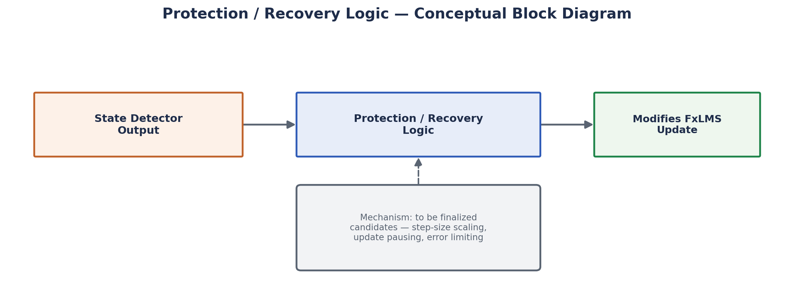

# Protection and Recovery

## 1. Purpose
Explain the intended purpose of a state-dependent Protection/Recovery mechanism for the adaptive filter, and clearly separate what our implementation currently does from what remains **to be finalized**.

## 2. Why It Is Required in This Project
`FxLMS_Algorithm.md` (§17) and `State_Detector.md` establish that (a) plain FxLMS can be destabilized by impulsive input, and (b) the state detector can flag when such an event is likely occurring. Protection/Recovery is the layer that is *intended* to translate a detected event into a concrete change in filter behaviour, so that a single disruptive event does not permanently corrupt the adaptive filter's coefficients.

## 3. Basic Concept
The general, well-established idea in the adaptive-filtering literature (see `Robust_ANC.md`) is that an adaptive filter can be made more robust to outlier-driven instability by *limiting how much a single anomalous sample is allowed to influence the coefficient update* — for example by pausing adaptation, reducing the effective step size, or bounding the error term used in the update — during a detected disturbance, and then returning to normal adaptation once the disturbance has passed.

## 4. Intended Role of Each State

| State | Intended behavioural goal |
|---|---|
| **Normal** | The adaptive filter continues its standard FxLMS weight-update as described in `FxLMS_Algorithm.md`. |
| **Protection** | The system is intended to reduce the adaptive filter's exposure to the disruptive input so that filter coefficients are not driven unstable by a transient. |
| **Recovery** | The system is intended to resume adaptation in a controlled, gradual manner rather than instantaneously returning to full-strength adaptation, to avoid re-triggering instability from residual transient effects. |

## 5. What Is Explicitly Marked "To Be Finalized"

Per the project specification's own instruction, we do **not** assert specific coefficient-freezing rules, exact step-size scaling factors, or specific output-gain-control behaviour beyond what is demonstrably present in the current implementation/specification. The following design questions are **open / to be finalized** through further experimentation (see `06_Experiments/`):

- The exact mechanism used during Protection (e.g., full coefficient freeze vs. step-size reduction vs. error clipping) — general robust-ANC literature discusses several such mechanisms (see `Robust_ANC.md`), but our specific choice and its parameters are not yet fixed.
- The exact recovery ramp profile (e.g., linear ramp-up of step size, fixed dwell time) used when transitioning from Recovery back to Normal.
- Any output-gain reduction applied to the secondary source during Protection, if any.

Any documentation, diagram, or demonstration describing one of these mechanisms should be read as **illustrative of the design intent**, not as a claim that the exact behaviour has been finalized, tuned, or validated.

## 6. Block Diagram Description (Conceptual)

```
 State Detector output ──► [ Protection/Recovery Logic ] ──► modifies FxLMS update
                                     │
                     (mechanism: to be finalized — candidates include
                      step-size scaling, update pausing, error limiting)
```



## 7. Inputs and Outputs
- **Inputs:** current state label from the State Detector (`Normal` / `Protection` / `Recovery`).
- **Outputs:** a modification applied to the FxLMS adaptation process (mechanism to be finalized).

## 8. Important Parameters (Pending Finalization)
- Protection-state adaptation scaling factor (if step-size reduction is chosen).
- Recovery ramp duration/profile.
- Any minimum dwell time in each state to avoid rapid state chattering.

## 9. Advantages of the General Approach
- Keeps the core FxLMS algorithm simple and computationally cheap, while adding robustness only when needed (an event-gated approach, rather than always running a more expensive robust algorithm — see the comparison in `Robust_ANC.md`).
- Conceptually modular: the detector and the protection logic can be tuned/evaluated independently.

## 10. Limitations
- Effectiveness depends entirely on the state detector's accuracy (false negatives leave the filter unprotected; false positives unnecessarily suppress adaptation during legitimate loud sounds such as speech — see `State_Detector.md` §9).
- Because the specific gating mechanism is not yet finalized, no attenuation, stability, or recovery-time numbers can currently be claimed for this component; see `06_Experiments/` for the evaluation protocol intended to fill this gap.

## 11. How It Is Used in SIH26052
This mechanism is our proposed answer to the problem statement's requirement to safely handle impulsive disturbances without simply disabling cancellation or accepting filter divergence.

## 12. Relationship to Our Current Implementation
**Partially Implemented:** the state machine and its transitions exist and are visualized in the State Detector panel; the *link* from state to a specific FxLMS behavioural change exists in the Impulse Experiment panel to demonstrate the concept, but the specific, tuned gating mechanism (step-size scaling values, freeze duration, etc.) is **to be finalized** rather than a fixed, validated design.

## 13. Relevant Research References
General robust/gated adaptive-filtering concepts are discussed alongside the impulsive-noise ANC literature — see Mirza, Zeb & Sheikh (2016) and related entries in `08_References/Research_Papers.md`.
